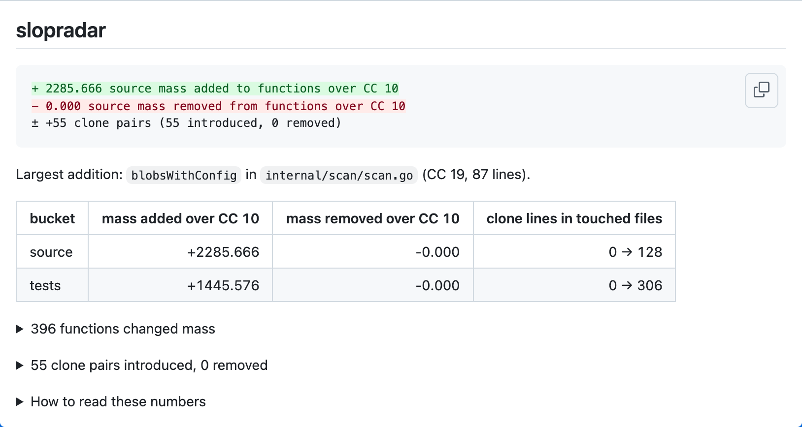

# slopradar

slopradar shows reviewers how a pull request changes concentrated complexity and
exact duplication. It reads Git, writes a Markdown comment, and keeps the two
signals separate so a movement in one cannot hide a movement in the other.

## What it measures

Cyclomatic complexity (CC) counts decision paths through a function. SLOC is its non-blank, non-comment source lines. Mass is CC × √SLOC; erosion is the share of repository function mass in functions with CC over 10. A clone pair is two ranges with the same tokens after comments are removed, while clone share is the share of source lines in such ranges. Lower erosion and clone share are generally easier to maintain, but duplication is not always wrong. Absolute erosion varies by language, so compare this repository against its own history. This report is information for the reviewer, not a merge gate.

Functions nested inside another function are folded into the outer function's
CC, SLOC, and mass. slopradar also keeps rows for nested functions so the report
can point inside a monolith, but only top-level rows enter erosion totals. Clone
detection compares exact lexical tokens after removing comments, with the
50-token and 5-source-line minimums used for the project's pinned prototype
receipts.

Python tokens also carry parsed suite boundaries. Every tree-sitter `block`
with retained tokens contributes an unambiguous NUL-prefixed open/close pair,
anchored to the first and last retained physical token lines. A block containing
only removed comments or docstrings contributes neither marker. Tabs and spaces
that parse to the same nesting therefore compare equally, inline suites retain
the same block shape, and indentation inside a continued expression contributes
no suite boundary. String-content whitespace remains exact. This analysis does
not invoke a Python runtime.

## Install

slopradar supports Linux and macOS on arm64 and amd64. Installation needs Go
1.27 or newer, cgo, and a C compiler:

```sh
go install github.com/SolenesInc/slopradar/cmd/slopradar@v0.1.0
```

The module includes Oxc 0.149.0 native archives for every supported platform,
so installation does not need Rust, Cargo, or Node. Maintainers only need the
pinned Rust 1.96.0 toolchain when rebuilding those archives; the measured
platform compatibility and rebuild procedure live in
[`internal/oxc/README.md`](internal/oxc/README.md).

## Add it to a pull request

Add `.github/workflows/slopradar.yml`:

```yaml
name: slopradar

on:
  pull_request:

permissions:
  contents: read
  pull-requests: write

jobs:
  slopradar:
    runs-on: ubuntu-latest
    steps:
      - uses: actions/checkout@v4
      - uses: SolenesInc/slopradar@v0.1.0
        with:
          trend-months: "0"
          comment: "true"
```

The action builds its binary from the same checkout that supplied its scripts,
so a moved ref or fork cannot mix code from two sources. The standalone
versioned `go install` command above remains available for CLI installation.

The action always writes the report to the job summary. It creates one PR
comment and updates that same comment on later runs. On a fork pull request, or
a [Dependabot pull request whose token is read-only](https://docs.github.com/en/code-security/reference/supply-chain-security/dependabot-on-actions#restrictions-when-dependabot-triggers-events),
it keeps the summary and says in the job log that it skipped the comment. Other
API failures stay visible. The numbers never fail the job.

Reports within GitHub's
[65,536 UTF-16-code-unit comment capacity](https://github.com/github/branch-deploy/blob/826fd07b4eae2e0a6b750c2a19d68b6c8d509cc0/__tests__/functions/truncate-comment-body.test.ts)
appear in full. Above it, the comment keeps the complete headline-and-bucket
prefix when it fits, then names the capacity and actual size and links the
workflow run. If that prefix is itself too large, the comment falls back to a
short linked notice. If a report exceeds GitHub's
[1 MiB job-summary capacity](https://docs.github.com/en/actions/reference/workflows-and-actions/workflow-commands#step-isolation-and-limits),
the action uploads the untouched Markdown as an artifact and posts a compact
linked summary. It never cuts through a table or code fence; the exact edges
are covered by the [boundary tests](scripts/report-bounds.test.cjs).

The action accepts `base` (the pull request's base ref by default),
`trend-months` (`0` disables the trend), and `comment` (`true` by default).

## Read the comment



The headline reports absolute mass added to and removed from functions over CC
10, plus clone pairs introduced and removed. Those are the useful pull-request
signals: repository-wide ratios can barely move even when a change adds a large
complex function. Expand the details for per-function CC, SLOC, mass changes,
clone locations, and the metric explainer. When the trend is enabled, compare
erosion and clone share with this repository's own earlier points, not another
language or repository.

## Commands

```text
slopradar scan [<rev> | <dir>] [--format text|md|json] [--no-cache]
slopradar diff --base <rev> --head <rev> [--trend <months>] [--format text|md|json] [--no-cache]
slopradar trend (--merges <count> | --months <count>) [--format text|md|json] [--no-cache]
```

`scan` defaults to `HEAD`. A directory target reads the working tree; a revision
target reads Git objects without checking them out. `diff` resolves its base to
the merge base of `--base` and `--head`. `trend` walks first-parent history.

Revision scans report the Git tree ID in `rev`, so commits with identical trees
produce identical output. Directory scans use `directory`. Diff `base` and `head`
and each trend point's `rev` retain commit IDs to identify the compared history.

The cache stores analysis by blob SHA, language, and analyzer version under the
operating system's user cache directory. `--no-cache` bypasses it. Deleting the
cache is always safe, and slopradar never writes it into the repository being
analyzed.

## Configuration

An optional `.slopradar.json` at the repository root adds exclusions and test
paths to the built-in classification:

```json
{
  "excludes": ["third_party/", "app/src/types/generated.ts"],
  "test_globs": ["integration/"]
}
```

Built-in exclusions are `vendor/`, `node_modules/`, `dist/`, `target/`, Go files
under `testdata/`, and dot directories. Built-in test paths are Go `_test.go` files;
JavaScript and TypeScript `.test.*`, `.spec.*`, and `__tests__/`; Python
`test_*.py`, `*_test.py`, and `tests/`; and Rust `tests/` plus `#[cfg(test)]`
items and `#[test]` functions. Rust also recognizes compound `cfg` predicates
that prove an item requires a test build, such as `all(test, unix)` and
`not(not(test))`. Predicates that can permit a production build, such as
`any(test, unix)`, stay in the source bucket. Other configuration options remain
unknown; their target or feature values are never guessed. These combinations
follow the [Rust conditional compilation rules](https://doc.rust-lang.org/reference/conditional-compilation.html).

Configuration globs use `/` as the path separator on the supported Unix
platforms. A backslash escapes the next glob character; it is not a separator.

Output keeps ordinary UTF-8 paths unchanged. To represent every Unix filename
without collisions, path backslashes are written as `\\`, line breaks as `\n`
or `\r`, tabs as `\t`, other control characters as `\uHHHH`, and invalid UTF-8
bytes as `\xHH` with uppercase hex digits. Decode those escapes after decoding
JSON itself; a literal sequence such as `\xFF` is written as `\\xFF`.

Generated files are skipped when a leading comment contains Go's
`Code generated … DO NOT EDIT.`, `@generated`, or `linguist-generated` marker.
Marker text inside a string literal does not exclude a handwritten file.
JavaScript line comments end at LF, CRLF, CR, U+2028, or U+2029, so marker
strings on the following source line stay outside the comment.
Generator output without a marker must be listed in `excludes`.

## Languages and decision points

Every function starts at CC 1. The following syntax adds one decision point.

Go declarations without bodies contribute no function mass: their implementations
are outside the analyzed Go source. Empty implemented functions and function
literals still count. This follows the project's Go baseline prototype;
gocyclo's inclusion of bodyless declarations is deliberately different.

| Language | Decision points |
| --- | --- |
| Go | `if`; `for` and `range`; each non-default expression-case, type-case, and communication-case clause; each `&&` and `\|\|` |
| TypeScript, TSX, JavaScript | `if`; `for`, `for…in`, and `for…of`; `while` and `do…while`; `catch`; each non-default `switch` case; ternary expressions; each `&&`, `\|\|`, and `??` |
| Python | `if` and each `elif`; `for`; `while`; `except`; each boolean operator; ternary expressions; each comprehension `for` and `if` clause; each `match` case |
| Rust | `if` and `if let`; `while` and `while let`; `for`; `loop`; each `match` arm; each `&&`, `\|\|`, and `?` |

Python docstrings count as comments. Rust's `?` counts as an explicit
error-flow decision, analogous to the explicit error checks visible in Go.

Rust method names include their owner: `Worker::run` for an inherent method,
`Service::run` for a trait default, and `<Worker as Service>::run` for a trait
implementation. Nested test functions retain their test bucket in drill-down
rows; totals still include only top-level functions.

Inline Rust modules and nested Python classes retain their complete owner paths,
such as `alpha::inner::run` and `Outer.Inner.run`. Function boundaries stop owner
inheritance for nested local functions; their enclosing function row already
provides that context.

JavaScript and TypeScript class and object-literal members also retain their
owner, such as `Worker.run` and `worker.handlers.run`. Object ownership follows
direct variable, assignment, and nested-property paths. It stops at function
and callback boundaries, and an explicit function-expression name takes
precedence.

## Baselines

These are source-bucket erosion measurements made with the shipped CLI at
commit `4a25522`, using Go `1.27.1` and `--no-cache`. Each row is restricted to
the stated language and path because erosion is language-bound. The adjacent
prototype value is the expectation recorded before the production parsers were
integrated.

Each `$BASELINES` subdirectory is a clean copy of only the paths named in its
row at the pinned revision. As in the prototypes, the TypeScript copies omit
declaration files, and the attn copy explicitly excludes its unmarked generated
file. For the commands below, `erosion '\.go$'` and
`erosion '\.(ts|tsx)$'` mean:

```sh
erosion() {
  jq --arg files "$1" '[.functions[] | select(.bucket == "source" and (.file | test($files)))] as $f | (($f | map(select(.cc > 10) | .mass) | add) / ($f | map(.mass) | add))'
}
```

| Corpus | Pinned revision | Shipped | Prototype | Command |
| --- | --- | ---: | ---: | --- |
| Go standard library | `go1.27.1`, `$GOROOT/src` | 0.742 | 0.743 | `slopradar scan --no-cache --format json "$GOROOT/src" \| erosion '\.go$'` |
| `golang.org/x/tools` | `v0.49.0` | 0.721 | 0.722 | `slopradar scan --no-cache --format json "$BASELINES/tools" \| erosion '\.go$'` |
| `honnef.co/go/tools` (staticcheck) | `v0.8.1` | 0.748 | 0.749 | `slopradar scan --no-cache --format json "$BASELINES/staticcheck" \| erosion '\.go$'` |
| `net/http` | `go1.27.1`, `$GOROOT/src/net/http` | 0.588 | 0.589 | `slopradar scan --no-cache --format json "$GOROOT/src/net/http" \| erosion '\.go$'` |
| `os` | `go1.27.1`, `$GOROOT/src/os` | 0.476 | 0.477 | `slopradar scan --no-cache --format json "$GOROOT/src/os" \| erosion '\.go$'` |
| attn Go, `cmd` and `internal` | `e05560650af06855452a9793a4f987ded9ca1d99` | 0.593 | 0.593 | `slopradar scan --no-cache --format json "$BASELINES/attn-go" \| erosion '\.go$'` |
| zod, `packages/zod/src` | `46da95720b7293f156ad9c683c14bd8ab9664c2f` | 0.804 | 0.805 | `slopradar scan --no-cache --format json "$BASELINES/zod" \| erosion '\.(ts\|tsx)$'` |
| vitest, `packages/*` | `2ce29d5fa758046e5453bd92b8ed6c9da9709bb5` | 0.652 | 0.652 | `slopradar scan --no-cache --format json "$BASELINES/vitest" \| erosion '\.(ts\|tsx)$'` |
| excalidraw, `packages` and `excalidraw-app` | `afa3a653fc5d2b742adcbd5a6063187b056d2419` | 0.795 | 0.796 | `slopradar scan --no-cache --format json "$BASELINES/excalidraw" \| erosion '\.(ts\|tsx)$'` |
| attn TypeScript, `app/src`, `app/lint`, `sdk`, and `plugins` | `e05560650af06855452a9793a4f987ded9ca1d99` | 0.912 | 0.912 | `slopradar scan --no-cache --format json "$BASELINES/attn-ts" \| erosion '\.(ts\|tsx)$'` |

The production and prototype figures differ slightly because their parsers do
not define identical rows. The shipped Go analyzer includes module-level
closures and strips parsed comment spans; the prototype only walked declared
functions and approximated comment removal line by line. The shipped
TypeScript analyzer uses Oxc, while the prototype used the TypeScript compiler.
The Vitest and other TypeScript receipt directories omit declaration files, as
the prototype did. The attn TypeScript receipt also excludes its unmarked
`app/src/types/generated.ts`; a default scan includes unmarked generated output.

Test-directory conventions are language-specific. The production Go analyzer
in `x/tools/go/analysis/passes/tests/tests.go` is included as source. TypeScript
helpers in ordinary `tests/` directories are also source unless their filenames
or configured globs classify them as tests. This affects one zod helper and
nine Excalidraw helper or fixture files in these scopes. The
[baseline guide](docs/baselines.md) explains the corrected historical receipts.

The Go analyzer uses the Go 1.27 standard parser and accepts generalized
`new(expression)` and generic methods. The full standard-library scan completes
without warnings. It names generated `cmd/compile/internal/ssa/opGen.go` and
`cmd/compile/internal/ssa/rewriteAMD64.go` as skipped above the documented file
size tripwire.

The [full baseline receipt](docs/baselines-v0.1.0.json) preserves the inputs,
commands, warnings, and unrounded outputs. The
[reproduction guide](docs/baselines.md) records how each scoped input was
assembled.

## What it is not

- No merge gate or quality ratchet.
- No composite slop score.
- No author, model, or agent attribution.
- No hosted service.
- No per-repository baseline file or analysis output stored in your repository.

## Limitations

- Renamed or moved functions read as removed plus new in this release.
- Erosion ratios are language-bound. A mixed-language bucket is useful for a
  repository's own trend, not for comparing languages or unrelated projects.
- Clone detection is exact-token matching. A near-duplicate with renamed
  identifiers is not a clone in this release.
- Files above `max_file_bytes=2097152` are skipped and named with both the limit
  and requested size. This tripwire was set above attn revision `e05560650`'s
  measured largest source file (`925234` bytes) and largest handwritten source
  file (`256764` bytes).

## Credits

slopradar's mass and erosion model comes from
[SlopCodeBench (arXiv:2603.24755)](https://arxiv.org/abs/2603.24755). The
project also builds on [scb-check](https://github.com/gabeorlanski/scb-check)
and Sebastian's
[essay on measuring code sloppiness](https://earendil.com/posts/measuring-code-sloppiness/).

## License

[MIT](LICENSE)
