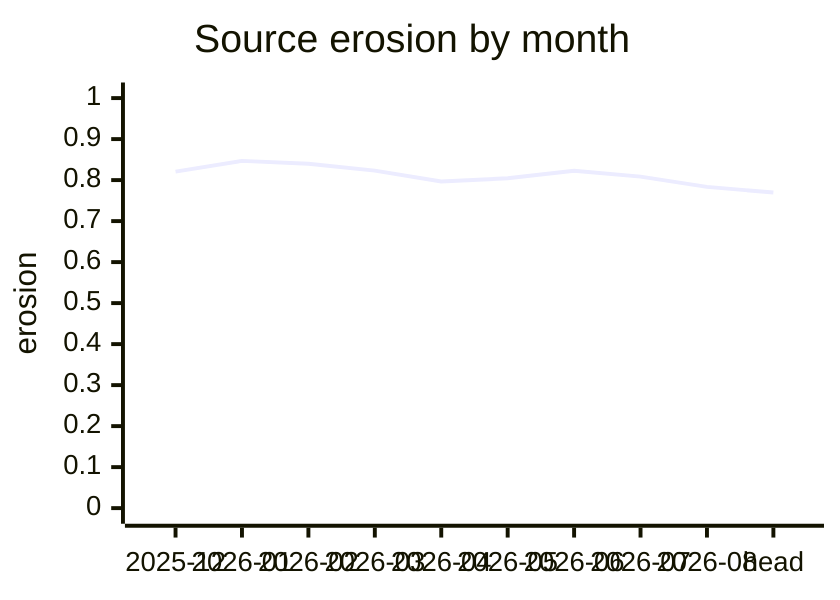

# slopradar

slopradar shows reviewers how a pull request changes concentrated complexity and
exact duplication. It reads Git, writes a Markdown comment, and keeps the two
signals separate so a movement in one cannot hide a movement in the other.


It analyzes Go, TypeScript, TSX, JavaScript, Python, and Rust. It runs as a
GitHub Action or as a command-line tool, stores nothing in your repository, and
never fails a job on its numbers.

## What it measures

- **Cyclomatic complexity (CC)** counts the decision paths through a function.
- **SLOC** is a function's non-blank, non-comment lines.
- **Mass** is CC × √SLOC. A pull request's headline is the mass it adds to and
  removes from functions over CC 10, as absolute numbers, because a ratio over a
  whole repository barely moves when one large complex function lands.
- **Erosion** is the share of a repository's function mass that sits in
  functions over CC 10.
- **A clone pair** is two ranges of at least 50 tokens and 5 lines whose tokens
  are identical after comment removal. **Clone share** is the share of
  source lines inside such ranges.

The report keeps source and test code in separate buckets. Erosion and clone
share are ratios, and a ratio only means something against the same
repository's own history, which is what the trend is for. Lower is generally
easier to maintain, but duplication is not always wrong, and absolute erosion
varies by language. [How slopradar analyzes code](docs/analysis.md) has the
exact rules for each language.

The mass and erosion model comes from the
[SlopCodeBench paper (arXiv:2603.24755)](https://arxiv.org/abs/2603.24755) and
Sebastian's [essay on measuring code sloppiness](https://earendil.com/posts/measuring-code-sloppiness/).

## Add it to a pull request

Add `.github/workflows/slopradar.yml`:

```yaml
name: slopradar

on:
  pull_request:

permissions:
  contents: read
  pull-requests: write

concurrency:
  group: slopradar-${{ github.event.pull_request.number }}
  cancel-in-progress: false

jobs:
  slopradar:
    runs-on: ubuntu-latest
    steps:
      - uses: actions/checkout@v4
      - uses: SolenesInc/slopradar@v0.1.0
        with:
          trend-months: "12"
          comment: "true"
```

Every run writes the report to the job summary and creates one comment on the
pull request, then updates that same comment on later pushes. The inputs are
`base` (the pull request's base branch by default), `trend-months` (`0` skips
the trend), and `comment` (`true` by default). [The GitHub Action](docs/action.md)
covers forks, oversized reports, and pinning.

## The comment

This is the comment for [attn pull request #286](https://github.com/SolenesInc/attn/pull/286),
rendered from the Markdown slopradar produced:

```diff
+ 523.999 source mass added to functions over CC 10
- 0.000 source mass removed from functions over CC 10
± -2 clone pairs (4 introduced, 6 removed)
```

Largest addition: <code>SessionTerminalWorkspace.cb:forwardRef.SessionTerminalWorkspace</code> in <code>app/src/components/SessionTerminalWorkspace/index.tsx</code> (CC 264, 1483 lines).

| bucket | mass added over CC 10 | mass removed over CC 10 | clone lines in touched files |
|---|---:|---:|---:|
| source | +523.999 | -0.000 | 144 → 137 |
| tests | +0.000 | -0.000 | 171 → 171 |

<details>
<summary>6 top-level function changes; 17 nested function changes</summary>

Nested rows are drill-down details and are excluded from headline and bucket totals.

| function | bucket before → after | CC before → after | SLOC before → after | Δmass | note |
|---|---|---:|---:|---:|---|
| <code>SessionTerminalWorkspace.cb:forwardRef.SessionTerminalWorkspace</code> in <code>app/src/components/SessionTerminalWorkspace/index.tsx</code> | source → source | 255 → 264 | 1453 → 1483 | +446.421 |  |
| <code>↳ renderPaneSurface.cb:useCallback[0]</code> in <code>app/src/components/SessionTerminalWorkspace/index.tsx</code> | source → source | 55 → 56 | 297 → 317 | +49.199 |  |
| <code>↳ ↳ (anonymous)</code> in <code>app/src/components/SessionTerminalWorkspace/index.tsx</code> | · → source | · → 1 | · → 6 | +2.449 | new |
| <code>↳ ↳ (anonymous)</code> in <code>app/src/components/SessionTerminalWorkspace/index.tsx</code> | · → source | · → 1 | · → 1 | +1.000 | new |
| <code>↳ cb:useEffect[0]</code> in <code>app/src/components/SessionTerminalWorkspace/index.tsx</code> | · → source | · → 4 | · → 5 | +8.944 | new |
| <code>↳ selectedWorkspaceSessionId.cb:workspaceSessions.find</code> in <code>app/src/components/SessionTerminalWorkspace/index.tsx</code> | · → source | · → 1 | · → 1 | +1.000 | new |
| <code>main</code> in <code>app/scripts/real-app-harness/scenario-workspace-switching.mjs</code> | source → source | 8 → 12 | 155 → 218 | +77.579 | crossed CC 10 |
| <code>↳ cb:runner.step[1]</code> in <code>app/scripts/real-app-harness/scenario-workspace-switching.mjs</code> | · → source | · → 5 | · → 61 | +39.051 | new |
| <code>↳ ↳ focusModeReceipt.restoredPaneIds.cb:restored.panes.filter</code> in <code>app/scripts/real-app-harness/scenario-workspace-switching.mjs</code> | · → source | · → 1 | · → 1 | +1.000 | new |
| <code>↳ ↳ focusModeReceipt.restoredPaneIds.cb:restored.panes.filter((pane)=&gt;pane.bounds?.width&gt;0).map</code> in <code>app/scripts/real-app-harness/scenario-workspace-switching.mjs</code> | · → source | · → 1 | · → 1 | +1.000 | new |
| <code>↳ ↳ focused.cb:focusedSnapshot.sessions.find</code> in <code>app/scripts/real-app-harness/scenario-workspace-switching.mjs</code> | · → source | · → 1 | · → 1 | +1.000 | new |
| <code>↳ ↳ focusedPane.cb:focused.panes.find</code> in <code>app/scripts/real-app-harness/scenario-workspace-switching.mjs</code> | · → source | · → 1 | · → 1 | +1.000 | new |
| <code>↳ ↳ hiddenPeer.cb:focused.panes.find</code> in <code>app/scripts/real-app-harness/scenario-workspace-switching.mjs</code> | · → source | · → 1 | · → 1 | +1.000 | new |
| <code>↳ ↳ restored.cb:restoredSnapshot.sessions.find</code> in <code>app/scripts/real-app-harness/scenario-workspace-switching.mjs</code> | · → source | · → 1 | · → 1 | +1.000 | new |
| <code>↳ ↳ restoredPane.cb:restored.panes.find</code> in <code>app/scripts/real-app-harness/scenario-workspace-switching.mjs</code> | · → source | · → 1 | · → 1 | +1.000 | new |
| <code>↳ ↳ restoredPeer.cb:restored.panes.find</code> in <code>app/scripts/real-app-harness/scenario-workspace-switching.mjs</code> | · → source | · → 1 | · → 1 | +1.000 | new |
| <code>hold</code> in <code>app/scripts/real-app-harness/scenario-workspace-switching.mjs</code> | · → source | · → 2 | · → 1 | +2.000 | new |
| <code>cb:test.describe[1]</code> in <code>app/e2e/workspace-sessions.spec.ts</code> | tests → tests | 1 → 1 | 79 → 103 | +1.261 |  |
| <code>↳ cb:test[1]</code> in <code>app/e2e/workspace-sessions.spec.ts</code> | · → tests | · → 1 | · → 24 | +4.899 | new |
| <code>cb:describe[1]</code> in <code>app/src/components/SessionTerminalWorkspace/SessionTerminalWorkspace.paneHeader.test.tsx</code> | tests → tests | 1 → 1 | 234 → 242 | +0.259 |  |
| <code>↳ cb:it[1]</code> in <code>app/src/components/SessionTerminalWorkspace/SessionTerminalWorkspace.paneHeader.test.tsx</code> | · → tests | · → 1 | · → 8 | +2.828 | new |
| <code>cb:describe[1]</code> in <code>app/src/components/SessionTerminalWorkspace/SessionTerminalWorkspace.attentionRing.test.tsx</code> | tests → tests | 8 → 8 | 392 → 393 | +0.202 |  |
| <code>↳ cb:it[1]</code> in <code>app/src/components/SessionTerminalWorkspace/SessionTerminalWorkspace.attentionRing.test.tsx</code> | tests → tests | 3 → 3 | 73 → 74 | +0.175 |  |

</details>

<details>
<summary>4 clone pairs introduced, 6 removed</summary>

<code>f1</code> = <code>app/scripts/real-app-harness/scenario-autoclose-on-exit.mjs</code><br>
<code>f2</code> = <code>app/scripts/real-app-harness/scenario-linux-shortcuts.mjs</code><br>
<code>f3</code> = <code>app/scripts/real-app-harness/scenario-notebook-editor-undo.mjs</code><br>
<code>f4</code> = <code>app/scripts/real-app-harness/scenario-terminal-block-copy.mjs</code><br>
<code>f5</code> = <code>app/scripts/real-app-harness/scenario-workspace-close-one-session-keeps-selection.mjs</code><br>
<code>f6</code> = <code>app/scripts/real-app-harness/scenario-workspace-creation-shortcuts.mjs</code><br>
<code>f7</code> = <code>app/scripts/real-app-harness/scenario-workspace-switching.mjs</code><br>

```text
+ f5:19-31 ↔ f7:26-38
+ f4:20-32 ↔ f7:26-38
+ f1:21-45 ↔ f7:26-50
+ f6:20-34 ↔ f7:26-40
- f2:14-25 ↔ f7:16-27
- f6:15-34 ↔ f7:18-37
- f1:21-45 ↔ f7:23-47
- f4:19-32 ↔ f7:22-35
- f5:14-31 ↔ f7:18-35
- f3:21-30 ↔ f7:20-29
```

</details>

<details>
<summary>How to read these numbers</summary>

Cyclomatic complexity (CC) counts decision paths through a function. SLOC is its non-blank, non-comment source lines. Mass is CC × √SLOC; erosion is the share of repository function mass in functions with CC over 10. A clone pair is two ranges with the same tokens after comments are removed, while clone share is the share of source lines in such ranges. Lower erosion and clone share are generally easier to maintain, but duplication is not always wrong. Absolute erosion varies by language, so compare this repository against its own history. This report is information for the reviewer, not a merge gate.

</details>

Start with the headline. It says how much mass the pull request adds to and
removes from functions over CC 10, and how many exact clone pairs it introduces
and removes. The largest addition names the function to open first. The bucket
table splits the same numbers into source and tests. The details list every
function whose mass changed, with nested functions (↳) as drill-down rows
outside the totals, then the clone pairs with their locations, then a short
explainer.

With `trend-months`, the comment ends with a chart of erosion by month for
each bucket, so a reviewer can see whether a pull request continues a direction
or reverses one. This is the source chart for the same pull request over twelve
months:



## Command line

slopradar supports Linux and macOS on arm64 and amd64. Install with Go 1.27
or newer, cgo, and a C compiler. The module ships the native parser archives
it needs, so there is no Rust or Node to install:

```sh
go install github.com/SolenesInc/slopradar/cmd/slopradar@v0.1.0
```

Three commands cover a pull request, a snapshot, and a history:

```sh
slopradar diff --base origin/main --head HEAD --trend 12
slopradar scan
slopradar trend --months 12
```

Each takes `--format text|md|json` and `--no-cache`. `text` is the default, and
`md` is what the Action posts. `scan` accepts a revision or a directory and
defaults to `HEAD`. `diff` compares from the merge base of its two revisions.
`trend` walks first-parent history and takes `--months` or `--merges`. A monthly
point is the repository at the end of its month.

`slopradar diff` on the same pull request, as text:

```text
base    85f6bf6f6b18e558f087bf9b8176dced8e10d45f
head    76c640caf5f2855d479de0608798e6215de11425
bucket  mass added over CC 10  mass removed over CC 10  clone lines touched before  clone lines touched after  erosion before  erosion after  clone share before  clone share after
source  +523.999               -0.000                   144                         137                        0.769           0.770          0.061               0.061
tests   +0.000                 -0.000                   171                         171                        0.386           0.386          0.144               0.144

functions
nested rows                                                                                  indented with > and excluded from headline and bucket totals
file                                                                                         name                                                                                           CC before  CC after  SLOC before  SLOC after  mass delta  note
app/src/components/SessionTerminalWorkspace/index.tsx                                        SessionTerminalWorkspace.cb:forwardRef.SessionTerminalWorkspace                                255        264       1453         1483        +446.421    
app/src/components/SessionTerminalWorkspace/index.tsx                                        >renderPaneSurface.cb:useCallback[0]                                                           55         56        297          317         +49.199     
app/src/components/SessionTerminalWorkspace/index.tsx                                        >>(anonymous)                                                                                  ·          1         ·            6           +2.449      new
app/src/components/SessionTerminalWorkspace/index.tsx                                        >>(anonymous)                                                                                  ·          1         ·            1           +1.000      new
app/src/components/SessionTerminalWorkspace/index.tsx                                        >cb:useEffect[0]                                                                               ·          4         ·            5           +8.944      new
app/src/components/SessionTerminalWorkspace/index.tsx                                        >selectedWorkspaceSessionId.cb:workspaceSessions.find                                          ·          1         ·            1           +1.000      new
app/scripts/real-app-harness/scenario-workspace-switching.mjs                                main                                                                                           8          12        155          218         +77.579     crossed CC 10
…
```

`slopradar scan` on slopradar itself starts with the bucket totals, then lists
every clone pair and every function with its CC, SLOC, and mass:

```text
revision  4da481e9f0e1a87f9540d0199bac3a4804f71aaf
bucket    functions  mass      mass over CC 10  erosion  source lines  clone lines  clone share
source    348        8139.933  4003.492         0.492    6265          94           0.015
tests     291        9218.845  3909.661         0.424    6725          1258         0.187
```

`--format json` carries the same data for scripts, with unrounded values for
the bucket totals, every function, and every clone pair.

## Configuration

An optional `.slopradar.json` at the repository root adds exclusions and test
paths to the built-in classification:

```json
{
  "excludes": ["third_party/", "app/src/types/generated.ts"],
  "test_globs": ["integration/"]
}
```

Patterns use Go's `path.Match` syntax, and a trailing slash matches a directory
with everything under it. Out of the box, slopradar skips `vendor/`,
`node_modules/`, `dist/`, `target/`, dot directories, and files with a
generated-code marker. Each language's usual test file and directory names go
in the tests bucket. [Source and test buckets](docs/analysis.md#source-and-test-buckets)
lists the built-in rules, including how slopradar follows Rust `#[cfg(test)]`
and module declarations.

## Baselines

Erosion of the source bucket in some well-known code bases, for a sense of
scale:

| Corpus | Erosion |
| --- | ---: |
| Go standard library, `go1.27.1` | 0.742 |
| `net/http` | 0.588 |
| `os` | 0.476 |
| `golang.org/x/tools` v0.49.0 | 0.721 |
| staticcheck v0.8.1 | 0.748 |
| attn, Go | 0.593 |
| zod | 0.804 |
| vitest | 0.652 |
| excalidraw | 0.795 |
| attn, TypeScript | 0.912 |

[Baselines](docs/baselines.md) records the exact revisions, scopes, and commands
behind each value, and how to reproduce them.

## What it is not

- No merge gate or quality ratchet.
- No composite slop score.
- No author, model, or agent attribution.
- No hosted service.
- No per-repository baseline file or analysis output stored in your repository.

## Limitations

- Renamed or moved functions read as removed plus new.
- Erosion ratios are language-bound. A mixed-language bucket is useful for a
  repository's own trend, not for comparing languages or unrelated projects.
- Clone detection is exact-token matching. A near-duplicate with renamed
  identifiers is not a clone.
- slopradar skips files over 2 MiB and names them in the report, unless a
  leading generated-code marker excludes them. [Oversized files](docs/analysis.md#oversized-files)
  has the limit and the measurement behind it.

## Development

[Development](docs/development.md) has the toolchain, the checks CI runs, and
the working agreement in [`AGENTS.md`](AGENTS.md).

## Credits

slopradar's mass and erosion model comes from
[SlopCodeBench (arXiv:2603.24755)](https://arxiv.org/abs/2603.24755). The
project also builds on [scb-check](https://github.com/gabeorlanski/scb-check)
and Sebastian's
[essay on measuring code sloppiness](https://earendil.com/posts/measuring-code-sloppiness/).

## License

[MIT](LICENSE)
