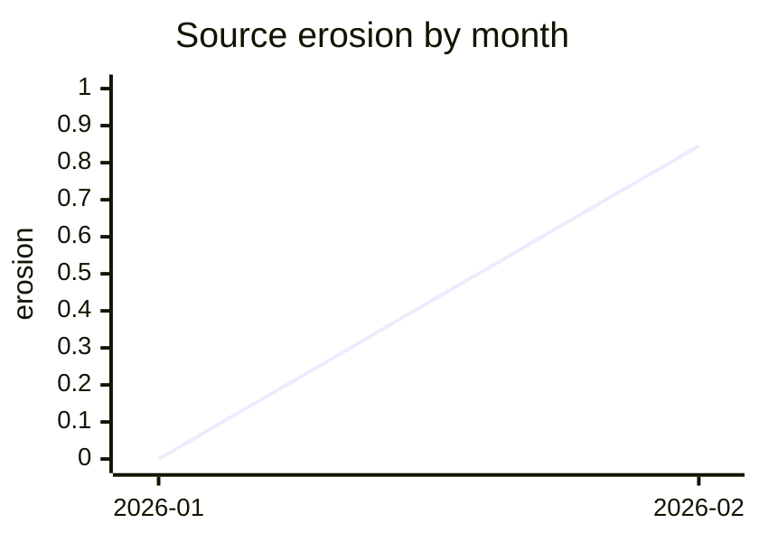
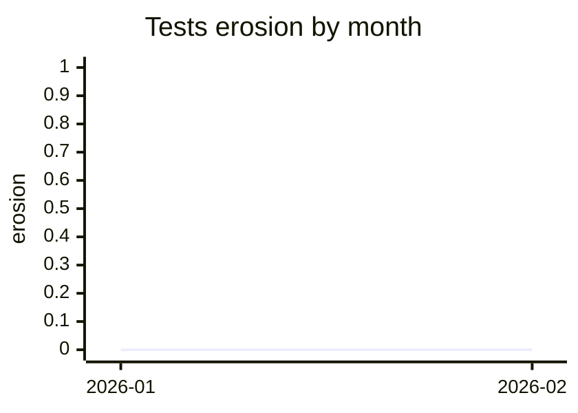

<!-- slopradar -->
## slopradar

```diff
+ 44.900 source mass added to functions over CC 10
- 0.000 source mass removed from functions over CC 10
± +1 clone pairs (1 introduced, 0 removed)
```

Largest addition: <code>complex</code> in <code>source.go</code> (CC 12, 14 lines).

| bucket | mass added over CC 10 | mass removed over CC 10 | clone lines in touched files |
|---|---:|---:|---:|
| source | +44.900 | -0.000 | 0 → 26 |
| tests | +0.000 | -0.000 | 0 → 0 |

```text
erosion, source  0.000 → 0.845  ▁█
erosion, tests   0.000 → 0.000  ▁▁
clone share, source  0.0% → 61.9%  ▁█
clone share, tests   0.0% → 0.0%  ▁▁
```

<details>
<summary>3 functions changed mass</summary>

| function | bucket before → after | CC before → after | SLOC before → after | Δmass | note |
|---|---|---:|---:|---:|---|
| <code>complex</code> in <code>source.go</code> | · → source | · → 12 | · → 14 | +44.900 | new |
| <code>duplicateA</code> in <code>source.go</code> | · → source | · → 1 | · → 13 | +3.606 | new |
| <code>duplicateB</code> in <code>source.go</code> | · → source | · → 1 | · → 13 | +3.606 | new |

</details>

<details>
<summary>1 clone pairs introduced, 0 removed</summary>

<code>f1</code> = <code>source.go</code><br>

```text
+ f1:20-32 ↔ f1:34-46
```

</details>

<details>
<summary>How to read these numbers</summary>

Cyclomatic complexity (CC) counts decision paths through a function. SLOC is its non-blank, non-comment source lines. Mass is CC × √SLOC; erosion is the share of repository function mass in functions with CC over 10. A clone pair is two ranges with the same tokens after comments are removed, while clone share is the share of source lines in such ranges. Lower erosion and clone share are generally easier to maintain, but duplication is not always wrong. Absolute erosion varies by language, so compare this repository against its own history. This report is information for the reviewer, not a merge gate.

</details>




